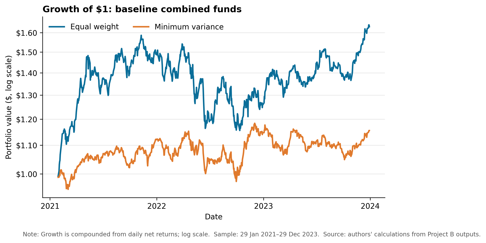
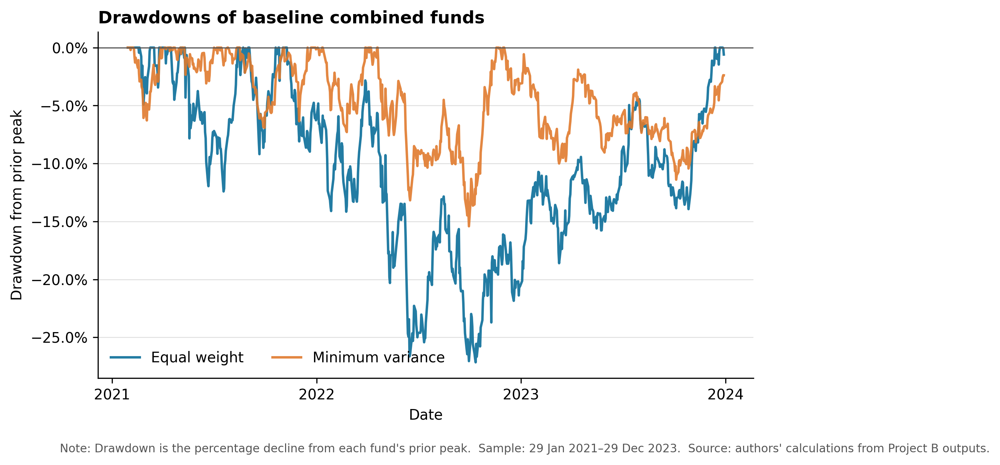
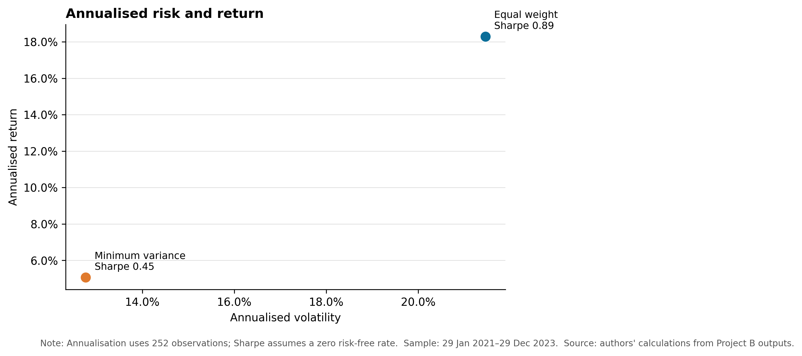
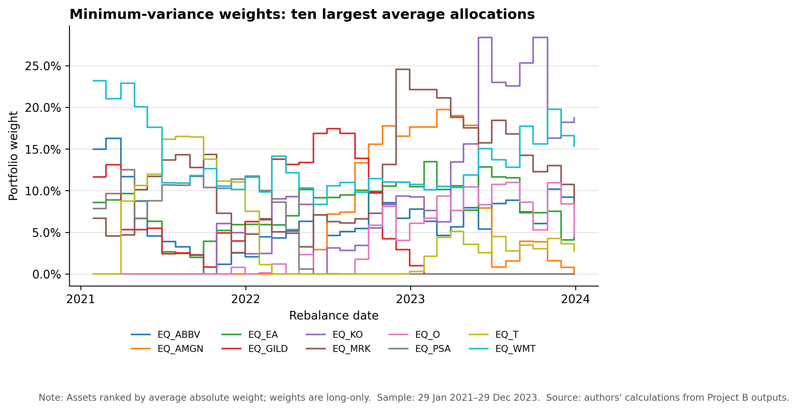
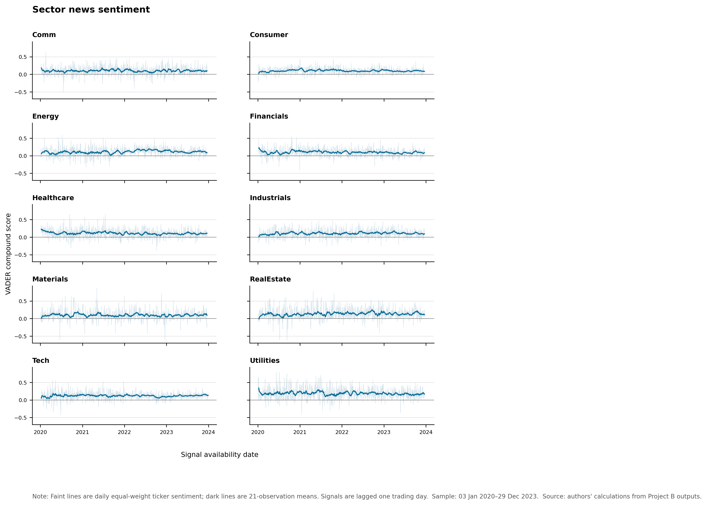
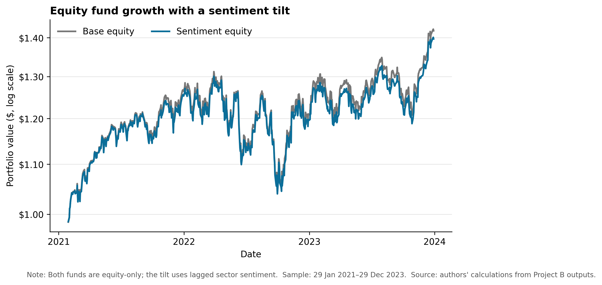
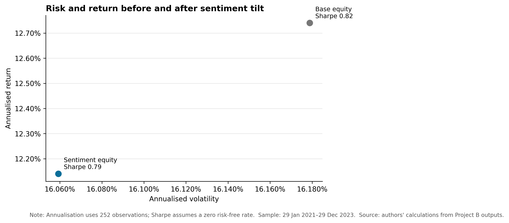
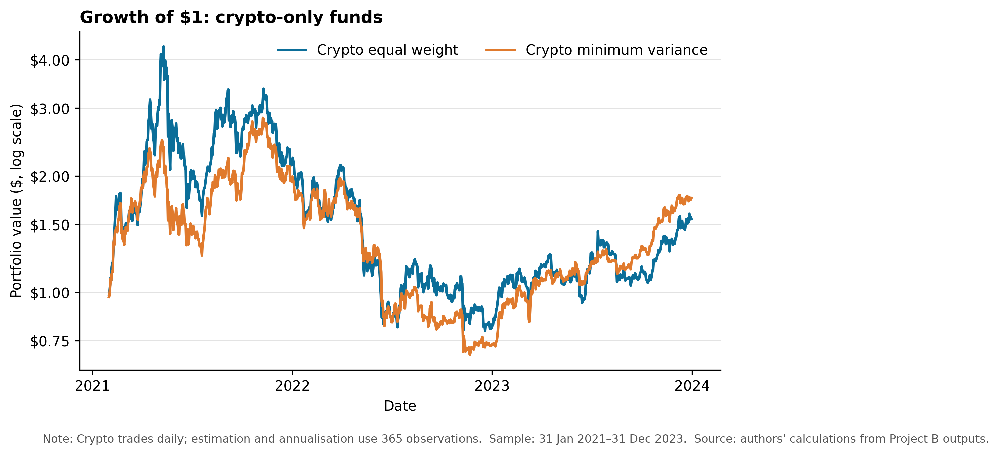

# Wealth Radar: Systematic Funds and Equity-Sector News Sentiment

## 1. Introduction and value proposition

Wealth Radar is a prototype investor dashboard for systematic multi-asset funds and equity-sector news sentiment analytics. Its central result is that the combined equal-weight fund produced the strongest risk-adjusted performance in the main comparison, with an annualised return of 18.29%, annualised volatility of 21.46%, and a Sharpe ratio of 0.89. More complex rules did not automatically improve performance. The combined minimum-variance fund reduced volatility and drawdown but earned only 5.07% per year, while the sentiment-tilted equity fund slightly underperformed its equal-weight equity benchmark. A crypto minimum-variance extension earned 21.28% per year, but its 62.17% volatility and 75.60% maximum drawdown make it a much riskier product rather than a dominant alternative.

The product is designed for an investor who wants to compare transparent rules-based funds without interpreting raw market data or model code. Wealth Radar presents historical growth, drawdowns, risk-adjusted performance, and current target holdings. It also provides a standalone view of news sentiment across ten US equity sectors and an allocation simulator across the investable funds. These results are historical out-of-sample simulations, not forecasts or investment advice.

The analysis uses 50 US equities, 10 cryptocurrencies, and news headlines linked to the 50 equities. The core offering contains two combined equity-plus-crypto funds: equal weight and long-only minimum variance. Two crypto-only funds extend the product. A separate experiment compares an equal-weight equity fund with a modest sector-sentiment tilt. Sentiment applies only to equities because the crypto dataset contains prices but no headline data.

## 2. Data and modelling overview

The provided data cover 2020–2023. Equity prices contain daily OHLCV fields, adjusted close, ticker, and sector for 50 large US companies across ten sectors. Crypto prices contain the corresponding daily market fields for 10 cryptocurrencies on a seven-day calendar. The news dataset contains dates, tickers, sectors, titles, URLs, and publishers for the equity universe. The project loads these datasets through the provided `src/data_access.py` helper and caps market data at 31 December 2023.

Daily simple returns are calculated separately for each asset class from adjusted close:

\[
r_{i,t}=\frac{P_{i,t}}{P_{i,t-1}}-1.
\]

Prices are sorted by ticker and date before percentage changes are calculated within each ticker. Computing returns separately is important because equities and cryptocurrencies operate on different calendars. The combined funds use the equity trading calendar. Crypto wealth is sampled on equity trading dates so that weekend crypto performance is compounded into the next equity-calendar observation rather than treated as a set of equity trading days. The final complete combined panel contains all 50 equities and 10 cryptocurrencies.

The standalone crypto funds retain the native seven-day crypto calendar. This separation avoids applying equity-frequency assumptions to crypto-only results. Combined and equity-only metrics use 252 observations per year, while crypto-only metrics use 365. All Sharpe ratios assume a zero risk-free rate. The analysis excludes transaction costs, management fees, taxes, market impact, and slippage.

## 3. Funds and out-of-sample backtest design

The portfolio tests use a walk-forward out-of-sample design with month-end rebalancing. For combined and equity-only funds, the initial estimation window contains 252 complete trading-day observations. The first live combined and equity return is 29 January 2021. Crypto-only funds use 365 prior daily observations and first become live on 31 January 2021. In each case, the estimation slice for a return on date \(t\) ends at \(t-1\). The model therefore cannot use the return being earned to select its own weight.

The equal-weight method assigns the same weight to every eligible asset. The combined fund holds \(1/60\), or 1.67%, in each of 60 assets at every rebalance. The crypto-only version holds 10% in each of 10 cryptocurrencies. Equal weighting provides a transparent benchmark and does not estimate expected returns or covariances.

The minimum-variance method estimates the covariance matrix from the trailing window and chooses weights to minimise portfolio variance:

\[
\min_w w'\Sigma w \quad \text{subject to} \quad \sum_i w_i=1,\quad 0\leq w_i\leq1.
\]

The implementation uses SLSQP optimisation, long-only bounds, and a fully invested constraint. It falls back to equal weight if optimisation fails. This rule avoids short positions but can still produce concentrated portfolios when estimated covariances favour a small subset of assets.

Annualised return is the geometric return implied by terminal wealth, annualised volatility is the sample standard deviation multiplied by the square root of 252 or 365, and the Sharpe ratio is the annualised mean return divided by daily volatility under a zero risk-free rate. Maximum drawdown is the largest percentage decline in compounded wealth from its previous peak.

## 4. Out-of-sample fund results and fact sheets

**Table 1. Out-of-sample performance of combined and crypto-only funds**

| Fund | Annualised return | Annualised volatility | Sharpe ratio | Maximum drawdown | Observations | Live sample |
|---|---:|---:|---:|---:|---:|---|
| Combined equal weight | 18.29% | 21.46% | 0.89 | -27.16% | 735 | 29 Jan 2021–29 Dec 2023 |
| Combined minimum variance | 5.07% | 12.77% | 0.45 | -15.42% | 735 | 29 Jan 2021–29 Dec 2023 |
| Crypto equal weight | 16.14% | 78.87% | 0.59 | -81.60% | 1,065 | 31 Jan 2021–31 Dec 2023 |
| Crypto minimum variance | 21.28% | 62.17% | 0.62 | -75.60% | 1,065 | 31 Jan 2021–31 Dec 2023 |

*Note: Combined funds use 252-day annualisation and the equity trading calendar. Crypto-only funds use 365-day annualisation and the native seven-day calendar. Sharpe ratios assume a zero risk-free rate. Source: `results/tables/performance_metrics.csv`.*

**Figure 1. Growth of $1 for the combined funds.** The equal-weight fund finishes at $1.63, compared with $1.16 for minimum variance. Equal weight experiences larger fluctuations, but its greater cumulative return compensates for the additional volatility over this sample. Minimum variance provides a smoother path but does not recover the return gap by December 2023.

**Figure 2. Drawdowns for the combined funds.** The risk reduction from minimum variance is visible in the shallower worst drawdown of 15.42%, compared with 27.16% for equal weight. The figure also shows that lower volatility is not equivalent to higher performance: the more defensive fund spends long periods below its previous peak while producing a lower terminal value.

**Figure 3. Annualised risk and return for the combined funds.** Minimum variance moves the portfolio down and left in risk-return space. Volatility falls by 8.69 percentage points, but annualised return falls by 13.23 percentage points. Its Sharpe ratio of 0.45 is roughly half the equal-weight fund's 0.89. For this sample, equal weight gives the stronger trade-off between return and total risk.

**Figure 4. Largest minimum-variance allocations over time.** The chart reports the ten assets with the highest average absolute weights because plotting all 60 assets would be unreadable. Weights vary substantially across monthly rebalances, which reflects changing covariance estimates. At the final rebalance, the largest positions are Coca-Cola (18.74%), Walmart (15.33%), Visa (9.72%), AbbVie (8.62%), and Merck (8.13%). This concentration contrasts with the stable 1.67% allocation in every asset under equal weight and suggests that turnover and estimation sensitivity require further testing.

The fund fact sheets should be read as different risk profiles rather than a ranking based only on return. Combined equal weight has the highest Sharpe ratio and a moderate drawdown relative to crypto. Combined minimum variance has the lowest volatility and smallest drawdown but sacrifices much of the return. The current target holdings in the app make this distinction concrete: equal weight remains fully diversified across 60 assets, while minimum variance concentrates on a smaller defensive group.

## 5. Sector sentiment index

The sentiment pipeline removes exact duplicate headlines using ticker, date, and title while preserving the raw title text. Preserving casing, punctuation, negation, and emphasis is appropriate for VADER because these text features affect its compound score. The model scores each headline, averages headlines to a ticker-day score, and then equally weights ticker-day scores within each sector. This two-stage aggregation prevents a ticker with more headlines from receiving a mechanically larger sector weight.

Headline timestamps are normalised to calendar dates. A headline on a non-trading day maps to the next equity trading day. The signal then moves forward by one additional trading day, so information aligned to day \(t\) is first usable on day \(t+1\). Days without sector news are omitted rather than assigned a zero score or carried forward. The resulting file contains 9,831 unique sector-day observations from 3 January 2020 to 29 December 2023 across Communication, Consumer, Energy, Financials, Healthcare, Industrials, Materials, Real Estate, Technology, and Utilities. Observed sector-day scores range from -0.6249 to 0.8591.

**Figure 5. Lagged sector news sentiment.** Faint lines show the daily equal-weight ticker index and dark lines show a 21-observation rolling mean for presentation. Daily scores are noisy, while the rolling lines reveal slower changes in tone. Average scores are positive in every sector over the sample; Utilities has the highest mean score (0.184), followed by Real Estate (0.133) and Technology (0.119). These levels should not be interpreted as causal forecasts. They partly reflect VADER's general-language lexicon and differences in headline coverage across sectors.

Sentiment is not applied to crypto. The crypto dataset contains no linked headlines or sector classification, so extending the equity signal to cryptocurrencies would require unsupported assumptions.

## 6. Sentiment fusion before/after comparison

The fusion experiment asks whether lagged sector sentiment improves a simple equity portfolio. Both funds contain only the 50 equities and follow the same 252-observation initial window, month-end schedule, and live sample beginning on 29 January 2021. The base fund assigns 2% to every equity.

At each rebalance, the augmented fund calculates each sector's mean over its latest 21 available sentiment observations. The implementation accepts only sentiment output dates strictly earlier than the rebalance date, even though the standalone index is already lagged. Sector scores are mapped to stocks, demeaned across the eligible equities, and scaled to the interval from -1 to 1. Each 2% base weight changes by no more than 0.5 percentage points. The adjustment is zero-sum, long-only, and normalised to remain fully invested. This bounded rule gives the signal a modest role rather than allowing sentiment to dominate the portfolio.

**Table 2. Equity sentiment-fusion comparison**

| Fund | Annualised return | Annualised volatility | Sharpe ratio | Maximum drawdown | Observations |
|---|---:|---:|---:|---:|---:|
| Base equity equal weight | 12.74% | 16.18% | 0.82 | -20.32% | 735 |
| Sentiment-tilted equity | 12.14% | 16.06% | 0.79 | -20.06% | 735 |

*Note: Both funds cover 29 January 2021–29 December 2023 and use 252-day annualisation. Source: `results/tables/sentiment_fusion_metrics.csv`.*

**Figure 6. Growth of $1 before and after the sentiment tilt.** The paths remain close because the tilt is deliberately capped. The augmented fund ends below the base fund, consistent with its annualised return being 0.60 percentage points lower. The chart provides no evidence that this simple VADER sector signal adds return over the test period.

**Figure 7. Risk and return before and after the sentiment tilt.** The augmented fund reduces volatility by 0.12 percentage points and improves maximum drawdown by 0.26 percentage points, but its Sharpe ratio falls from 0.82 to 0.79. The result is economically small and negative on risk-adjusted performance. Retaining this outcome is more informative than retuning the rule until it appears successful, because the unfavourable comparison shows the limits of a general-language headline score and a simple sector overlay.

## 7. Crypto-only fund extension and innovation

The crypto-only extension broadens Wealth Radar beyond the required combined portfolios. It applies the same auditable backtest engine to a different market calendar rather than forcing crypto into equity conventions. Both crypto funds use a rolling 365-observation window, rebalance on the final available calendar date of each month, and annualise performance over 365 days.

**Figure 8. Growth of $1 for crypto-only funds.** Both strategies rise sharply in 2021, lose most of those gains during 2022, and recover partially in 2023. Crypto equal weight finishes at $1.55, while crypto minimum variance finishes at $1.76. The minimum-variance strategy therefore improves terminal wealth and reduces volatility relative to crypto equal weight, but both paths involve losses that are much larger than those of the combined funds.

Crypto minimum variance records the highest annualised return in Table 1 at 21.28%, but it does not dominate combined equal weight. Its volatility is almost three times as high (62.17% versus 21.46%), its maximum drawdown is 75.60% rather than 27.16%, and its Sharpe ratio is lower (0.62 versus 0.89). It also becomes highly concentrated. At the final rebalance, its target weights are approximately 52.40% TRX, 39.58% BTC, and 8.03% ETH, with negligible weights elsewhere; some historical rebalances reach a 100% maximum asset weight. The extension demonstrates return potential and calendar-aware design, but it also exposes covariance instability and concentration risk in a small crypto universe.

## 8. Streamlit app and investor journey

Wealth Radar converts the analysis into six investor-facing pages:

1. **Overview** introduces the product, reports the number of available funds, identifies the highest historical Sharpe ratio, and shows the performance table.
2. **Fund comparison** presents combined-fund growth, drawdown, risk-return, and the separate crypto growth comparison.
3. **Fund fact sheets** let the investor select a fund, review annualised return, volatility, Sharpe ratio, drawdown, observations, sample dates, and latest target holdings.
4. **Allocation simulator** accepts allocations across available funds, normalises them to 100%, combines precomputed daily fund returns, and displays historical growth and summary metrics. Crypto-only allocations use 365-day annualisation; allocations containing combined funds use their common equity-calendar observations and 252-day annualisation.
5. **Sentiment analytics** shows the sector small multiples and a selectable table of recent lagged sector observations.
6. **Sentiment fusion** compares the base and augmented equity funds and states directly that the sentiment version underperformed in this sample.

The deployed app does not load raw prices or headlines, download data, run backtests, or execute VADER. It reads committed CSV and PNG files under `results/`. The only app-side financial calculation combines already generated fund returns for the user's allocation. This separation keeps deployment reliable and prevents the displayed fund history from changing because of a model rerun during an app session. Missing-file checks provide a clear instruction to reproduce outputs locally if an artifact is unavailable.

## 9. Critical reflection

The analysis favours reproducibility and auditability over model complexity. The equal-weight benchmark is hard to improve because it avoids covariance estimation error and remains diversified. Minimum variance achieves its intended mechanical goal—lower volatility—but its estimated covariance matrix produces concentrated weights and weak returns in the combined sample. The crypto result makes this limitation more severe: long-only constraints do not prevent the optimiser from allocating nearly everything to one asset.

The calendar treatment is necessary but affects interpretation. Combined funds operate on equity dates, with intervening crypto returns compounded into the next equity observation. Crypto-only funds operate every day. Their metrics therefore use different observation frequencies and should not be compared as if the daily return processes were identical. The allocation simulator uses common dates whenever fund families are mixed.

The sentiment experiment is an association test, not a causal model. VADER provides a transparent baseline, but its general lexicon does not understand every finance-specific use of words such as liability, beat, miss, or downgrade. Publication time within a date is unavailable, so the pipeline uses a conservative date rule and an additional trading-day lag. This treatment limits look-ahead risk but may also discard some timely information. Missing-news sector days are omitted, which makes the index conditional on observed coverage.

Performance estimates also omit trading costs, turnover, bid-ask spreads, market impact, taxes, and management fees. Monthly rebalancing and unstable minimum-variance weights could make these omissions material. The 2021–2023 live period contains distinct market conditions but remains too short to establish persistent superiority. Results may change under other estimation windows, rebalance dates, covariance estimators, or regimes.

## 10. Three concrete recommendations

### 10.1 Add transaction costs and turnover analysis

The next version should calculate turnover at every rebalance and subtract asset-class-specific trading costs from realised returns. The analysis should report gross and net performance together. This addition is most important for minimum-variance portfolios because their weights change with covariance estimates, and for crypto because spreads and execution conditions differ from large US equities.

### 10.2 Improve the finance meaning of sentiment

The sentiment model should be compared with a finance-specific lexicon or an alternative financial NLP model. Validation should use a manually reviewed sample of headlines rather than assuming a more complex model is better. The revised index should keep the same ticker-day and equal-weight sector aggregation so that model changes can be isolated from aggregation changes.

### 10.3 Test robustness across windows, rebalance dates, and regimes

The portfolio and fusion rules should be rerun with several pre-specified estimation windows, alternative month-end or month-start rebalance dates, and subperiods representing different market regimes. The goal is not to select the best result after observing performance. A robustness table should show whether rankings and risk characteristics survive reasonable design choices.

## 11. AI workflow reflection

The AI workflow used seven staged tasks recorded in `ai/prompt_log_part_b.md`: requirements review, baseline backtest implementation, figure production, standalone sentiment, sentiment fusion, Streamlit development, and the crypto extension. Separating these tasks made each change easier to inspect and reduced the risk that a single broad prompt would silently mix data preparation, modelling, and deployment.

AI assistance was useful for translating requirements into functions, adding schema and weight checks, and generating reproducible plotting and app code. Local execution remained essential. The first sentiment run failed because news timestamps were timezone-aware while price dates were timezone-naive; the fix normalised both before calendar alignment. Visual inspection also detected scientific-notation labels on log-scale growth charts, which were replaced with readable dollar ticks. Streamlit testing exercised every page, and a real headless server returned a healthy response. The hand-in checker passed 21 checks after the completed outputs were present.

The workflow log records risks rather than treating generated code as correct by default. These risks include complete-case filtering, covariance instability, omitted costs, a judgement-based sentiment window and tilt cap, VADER's general-language limitations, and the distinction between equity and crypto calendars. The negative fusion result was retained rather than tuned away. This decision separates evidence from performance-driven model selection.

AI did not replace economic interpretation. The code and generated outputs provide measurements, but the conclusions—particularly that crypto minimum variance does not dominate combined equal weight and that the sentiment result is weak—depend on comparing return with volatility, drawdown, concentration, and implementation risk. Before submission, the student must review and rewrite any wording that does not reflect their own interpretation and confirm that the prompt log accurately describes their decisions.

## 12. References and methods notes

This draft relies on project-provided data and repository artifacts rather than external factual claims. The final Word report should use Word captions and cross-references and should add only verified bibliographic details.

- FINS5545 Project B brief, `PROJECT_BRIEF.md`.
- Provided project data-access helper, `src/data_access.py`.
- Return and portfolio implementation, `src/features.py` and `src/portfolios.py`.
- Sentiment and fusion implementation, `src/sentiment.py` and `src/fusion.py`.
- Reproduction pipeline, `scripts/run_part_b.py`.
- Main performance output, `results/tables/performance_metrics.csv`.
- Fusion output, `results/tables/sentiment_fusion_metrics.csv`.
- Sector sentiment output, `results/data/sector_sentiment_index.csv`.
- AI workflow record, `ai/prompt_log_part_b.md`.

For the final report, add a verified citation for the VADER method if required by the marking rubric. Do not add author, year, or publication details until they have been checked against an authoritative source.
